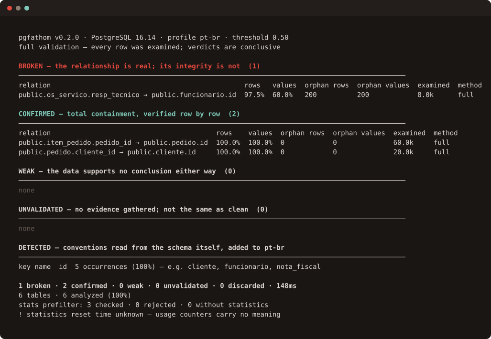

<p align="center">
  
</p>

<p align="center">
  <strong>Sound the depth of a legacy PostgreSQL schema.</strong>
</p>

<p align="center">
  
  
  
  
  
</p>

<p align="center">
  <a href="#the-problem">Problem</a> ·
  <a href="#what-it-does">What it does</a> ·
  <a href="#installing">Install</a> ·
  <a href="#first-run">First run</a> ·
  <a href="#safety">Safety</a> ·
  <a href="#how-it-works">How it works</a> ·
  <a href="#how-correctness-is-measured">Measurements</a> ·
  <a href="#prior-art">Prior art</a> ·
  <a href="#roadmap">Roadmap</a> ·
  <a href="docs/guide/README.md">Guide</a>
</p>

---

`pgfathom` finds the relationships your database has but never declared — and proves them against the data instead of guessing from column names.

Take a 1,857-key GitLab schema, drop half its foreign keys, and it brings **62.6%** of
them back; drop all of them and it still brings back **61.5%**. On a Brazilian municipal
schema whose reference affix no shipped profile knows — `idkey_lote` in one table,
`lote_idkey` in the next — it brings back **84.9%**, because it reads that convention off
the keys the schema still declares. Take those away too and the same schema falls to
**16.6%**, which is the number that says what the technique actually rests on. Both
regimes are published for every schema in [a corpus anyone can re-run](#the-measured-corpus),
and [what none of them measures](#how-correctness-is-measured) is stated as plainly as
what they do.

<p align="center">
  
</p>

Try it against a throwaway database, with nothing of yours involved:

```console
$ docker compose -f demo/compose.yaml up
```

That starts PostgreSQL, loads [a schema](demo/schema.sql) that declares almost none of its
own integrity, and prints exactly what you see above.

> [!IMPORTANT]
> **Early, and measured.**
> `pgfathom audit` and `pgfathom discover` run end to end — verdicts and reviewable
> `.sql` artifacts included — against real production schemas and against the public
> corpus. What the tool never does is write to your database. The image above is a real
> run against the demo schema in [`docs/DEMO.md`](docs/DEMO.md), re-recorded from the
> tool's own bytes by `make demo-svg` rather than screenshotted, and reproducible in a
> container in about a minute.

---

## The problem

Old PostgreSQL databases carry more structure than they declare.

```
=# \d pedido
      Column     |  Type  | Nullable
-----------------+--------+----------
 id              | bigint | not null
 cliente_id      | bigint | not null
 ...
Indexes:
    "pedido_pkey" PRIMARY KEY, btree (id)
```

No foreign keys. But `cliente_id` points at `cliente.id` in every single row — the ORM of
the day never created the constraint, or someone dropped constraints for a bulk load and
never put them back.

Two things follow. Nobody can read the model, because `\d` shows nothing and your ERD tool
draws a page of disconnected boxes. And because the constraint was never there, nothing
ever stopped orphan rows from getting in — so they probably already did, years ago,
silently, and no one has looked.

There is a nastier variant. A foreign key can be *declared* and still guarantee nothing, if
it was created `NOT VALID` and never validated. It shows up in `\d`. It draws an arrow in
your diagram. It never checked a single pre-existing row.

## What it does

```console
$ pgfathom discover --schema public --full
```

```

  pgfathom v0.2.0 · PostgreSQL 16.14 · profile pt-br · threshold 0.50
  full validation — every row was examined; verdicts are conclusive

  BROKEN — the relationship is real; its integrity is not  (1)
  ────────────────────────────────────────────────────────────────────────────────────────────────
  relation                                                rows   values  orphan rows  orphan values  examined  method
  public.os_servico.resp_tecnico → public.funcionario.id  97.5%  60.0%   200          200            8.0k      full

  CONFIRMED — total containment, verified row by row  (2)
  ────────────────────────────────────────────────────────────────────────────────────────────────
  relation                                         rows    values  orphan rows  orphan values  examined  method
  public.item_pedido.pedido_id → public.pedido.id  100.0%  100.0%  0            0              60.0k     full
  public.pedido.cliente_id → public.cliente.id     100.0%  100.0%  0            0              20.0k     full

  WEAK — the data supports no conclusion either way  (0)
  ────────────────────────────────────────────────────────────────────────────────────────────────
  none

  UNVALIDATED — no evidence gathered; not the same as clean  (0)
  ────────────────────────────────────────────────────────────────────────────────────────────────
  none

  DETECTED — conventions read from the schema itself, added to pt-br
  ────────────────────────────────────────────────────────────────────────────────────────────────
  key name  id  5 occurrences (100%) — e.g. cliente, funcionario, nota_fiscal

  1 broken · 2 confirmed · 0 weak · 0 unvalidated · 0 discarded · 148ms
  6 tables · 6 analyzed (100%)
  stats prefilter: 3 checked · 0 rejected · 0 without statistics
  ! statistics reset time unknown — usage counters carry no meaning
```

Three verdicts, three different responses.

**Broken** is the point of the tool. It is a data bug that has been in production for years
and nobody knows. `pgfathom` writes you the query that lists the orphans, because they have
to be resolved before any constraint can be added.

**Confirmed** is a foreign key someone forgot to declare. You get the DDL, with the
`VALIDATE CONSTRAINT` split out so the initial `ALTER TABLE` doesn't hold a heavy lock —
plus the `CREATE INDEX CONCURRENTLY` on the child column when it's missing, because an
unindexed FK child is a classic delete trap.

**Weak** is reported beside them. **Rejected** candidates are counted on every run and named
by `--include-rejected`, each with the score and the reason it fell — so you never wonder why
an obvious-looking column was ignored.

Note the first row: `os_servico.resp_tecnico → funcionario.id`. No name-matching heuristic
in the world finds that one — `resp_tecnico` looks nothing like `funcionario`. `pgfathom`
finds it by reading the join predicates out of your own view and function definitions.

How often that pays depends entirely on how much SQL your database stores. It is decisive
here and it recovered a single key across the public corpus, for a reason
[measured below](#the-measured-corpus): the schema dumps in it barely contain any joins to
read. A live application database is a different animal.

Output comes as a terminal report, a versioned JSON model, and reviewable `.sql` artifacts.

```console
$ pgfathom discover --full --out ./findings
```

```
  findings/confirmed.sql   2
  findings/broken.sql      1

  Review every file before running any of it.
```

The `.sql` files are written, never piped. Each one opens with the version, the timestamp
and the validation mode that produced it, and with the reminder that nothing inside was
meant to be run unread. DDL for a broken relationship stays commented out — it cannot pass
while an orphan remains, and deciding what happens to an orphan row is a call about your
domain, not one this tool is entitled to make.

## Installing

On Debian, Ubuntu, Fedora or RHEL, take the package for your architecture from the
[releases](https://github.com/lvcas-dotcom/pgfathom/releases):

```console
$ sudo dpkg -i pgfathom_*_linux_amd64.deb     # or: sudo rpm -i pgfathom_*_linux_amd64.rpm
$ pgfathom version
```

It installs the binary in `/usr/bin`, the licence and README under
`/usr/share/doc/pgfathom/`, and shell completion for bash, zsh and fish. There is no apt or
yum repository, so it does not update itself.

With Go installed:

```console
$ go install github.com/lvcas-dotcom/pgfathom/cmd/pgfathom@latest
```

Note that this puts the binary in `$(go env GOPATH)/bin`, which is not on everyone's `PATH`,
and that it reports its version but not its commit or build date — the module proxy carries no
git metadata to stamp. The release binaries carry all three.

Or take a binary from the [releases](https://github.com/lvcas-dotcom/pgfathom/releases)
— linux, macOS and Windows, amd64 and arm64, static, no runtime to install — and
check it against the `checksums.txt` published beside it. The artifacts are not
signed; the checksum file is what exists today, and
[`docs/RELEASING.md`](docs/RELEASING.md) says so where it can be found.

On macOS, Homebrew works once the tap exists:

```console
$ brew install lvcas-dotcom/tap/pgfathom
```

That is a cask, so it is macOS only, and it clears the quarantine attribute on
install because the binaries are not notarised — the cask says so when you
install it, and [`docs/RELEASING.md`](docs/RELEASING.md) explains why.

There is also a container image, on a base that carries root certificates
because the tool opens a TLS connection to your server:

```console
$ docker run --rm ghcr.io/lvcas-dotcom/pgfathom:latest discover --dsn "$DSN"
```

## First run

Twenty-one flags is a lot to meet at once, against a database you did not build, with the
person who authorised the access waiting. So there is a guide:

```console
$ pgfathom setup
```

It asks for the connection, lists the schemas **your server actually has with the number of
tables in each** — the most common way a first run ends in "nothing found" is pointing at a
default schema that holds six tables while the other sixty hold the database — then asks how
thoroughly to validate and where the reviewable SQL should go.

Then it prints the `discover` command your answers compose, and asks before running it. Copy
that line: the guide exists to teach the flags, not to replace them, and the second time you
will not need it.

It never asks for a password. The connection string comes from `PGFATHOM_DSN`, or is built
from host and database and left to your `~/.pgpass`.

## Scope

`pgfathom` analyses `public` and nothing else unless you say otherwise. That
default is conservative on purpose: this tool gets pointed at production databases
owned by someone who is nervous about it, and the run you make before reading any
documentation should be the cheapest one, not the most expensive.

```console
$ pgfathom discover --all-schemas --exclude-schema 'auditoria_*'
```

| Flag | Scope |
|---|---|
| *(none)* | `public` |
| `--schema a,b` | exactly those schemas |
| `--all-schemas` | every non-system schema the role can access |
| `--exclude-schema` | glob patterns of schemas to drop from scope |
| `--exclude` | glob patterns of **tables** to skip, matched inside the schemas in scope |

`--schema` and `--all-schemas` are mutually exclusive — there is no defensible
precedence between them, so passing both is a usage error rather than a guess.

Schema patterns and table patterns are separate flags, deliberately. If one
pattern meant both, `--exclude legacy` would quietly stop skipping a table called
`legacy` and start dropping the whole schema of that name.

**Whatever is left out gets named.** Every run reports the schemas it did not
analyse, including the run with no flags at all — a report about `public` that
never mentions the other eleven schemas is accurate and still misleading, and
whoever already knows to pass `--all-schemas` is not the person that silence was
fooling.

```
  12 schemas · 1 analyzed
    11 not analyzed: arquivo, financeiro, vendas, rh, fiscal and 6 more
       — pass --all-schemas to include them
```

## Safety

This tool is designed to be pointed at a production database owned by someone who is
nervous about it. Every guarantee below is a hard requirement in the spec, not a goal.

**Read-only, structurally.** `pgfathom` never issues a statement that modifies the database
under analysis — there is no write mode, under any flag, in any phase. The session sets
`default_transaction_read_only`, and a read-only role is documented as the recommended
setup. It emits `.sql` files for you to review and run yourself. Nothing generated is meant
to be executed unreviewed.

**Your data never leaves memory.** The tool reads values to compare keys. What comes *out*
of it are counts, ratios, and object names — never a value from your tables, in any output,
log, JSON field, or error message. This is enforced by a test that serializes every
structure and scans the result, not by code review. The target use case includes
public-sector databases holding national ID numbers, health records, and taxpayer data.

**It won't take your server down.** Every validation query runs under `statement_timeout`,
`lock_timeout`, and `idle_in_transaction_session_timeout`. Concurrency is capped and
configurable, defaulting low. The connection announces itself as `pgfathom` in
`pg_stat_activity` so your DBA can see exactly what is running. A candidate that times out
is recorded as unvalidated and the run continues.

**No claim without evidence.** Every inferred relationship carries a verdict and the metric
behind it. Sampled runs can never report a *confirmed* relationship — only `--full` can
prove absence of orphans.

**Silence is never reported as a clean bill of health.** Tables skipped for missing
privileges, candidates that timed out, schemas not covered — all of it appears in the
coverage block on every run. A clean report means "I looked and it's clean", never "I
couldn't look".

**Small dependency tree, on purpose.** Six direct dependencies, twenty-five modules in the
linked binary, 11 MB, no cgo. Four of the six do the work — the driver, the CLI framework,
the TOML reader and `x/sync`. The other two draw the interactive `setup` guide and are
reachable from nothing else; that cost was argued before it was paid, in
[`openspec/project.md`](openspec/project.md). The person who has to approve running this
against production will open `go.mod` first, and we intend that to be a short read.

## How it works

```
catalog  →  usage evidence  →  candidates  →  scoring  →  stats prefilter  →  validation
```

1. **Read the catalog.** Tables, columns, keys, indexes, comments, declared foreign keys
   *and their validation state*, usage statistics with their reset timestamp.

2. **Mine usage evidence.** Join predicates extracted from view definitions, function
   bodies, and — when available — `pg_stat_statements`. A view that joins two columns is
   proof that your code treats them as related, whatever they happen to be named. This is
   pure catalog: no user data, no cost, and it finds relationships name matching
   structurally cannot.

3. **Generate candidates.** Column-name affixes are stripped and matched against
   depluralized table names using a **naming profile** — a config file, not hardcoded
   rules. Ships with `pt-br`, `en`, and `es`.

4. **Score on metadata alone.** Exact name match, type identity, target ambiguity, existing
   index, comment mentions. Weak candidates are dropped before anything touches data.

5. **Prefilter on planner statistics.** If the child column has more distinct values than
   the parent has rows, full containment is arithmetically impossible. Free, from
   `pg_stats`, no I/O.

6. **Validate against the data.** One aggregate per surviving candidate — never fetching
   rows, only counts. Containment is reported in two dimensions, by row and by distinct
   value, because a single bad value repeated a million times and a million rare bad values
   are different problems.

## Naming profiles

Most schema tools assume English. The databases that need this tool most often aren't.

**The shipped default is `pt-br`, and every run prints which profile it used in its first
line.** That default is not a claim about your database — it is where this tool was built and
what it was built to read. If your schema is English, say so:

```console
$ pgfathom discover --profile en
```

What it costs you if you don't is the plural rules. `categories → category` and `boxes → box`
are in `en` and in no other profile, so under `pt-br` those columns fall through to the
lexical fallback — still found, at roughly half the name weight (0.08 against 0.15 for
`category_id` here), which means they now need the other signals to carry them over the
threshold rather than clearing it on their own. Naming detection, on by default, reads the
affix convention off your schema either way; what it reads is affixes, not grammar.

Affix and plural rules live in TOML, not in Go, so teaching `pgfathom` a new convention is
a config file rather than a patch:

```toml
name = "pt-br"

column_suffixes = ["_id", "_codigo", "_cod", "_key", "_ref", "_fk"]
table_prefixes  = ["tb_", "tbl_", "sys_", "cad_", "mov_"]

[[plural]]                     # opcoes → opcao
suffix = "oes"
singular = "ao"

[[plural]]                     # animais → animal
suffix = "ais"
singular = "al"
```

Normalization returns a *set* of candidate forms rather than one, so ambiguous plurals
(`logins` → `logim`? `login`?) cost nothing in recall — every form is tried, and the one
that matched is reported so scoring can tell an exact match from an aggressive one.

**Adding a profile for your language is the easiest possible contribution.** It needs no
knowledge of the rest of the codebase — a TOML file and a table of test cases.

## How correctness is measured

The headline metric is **recovery rate**: take a schema with complete foreign keys, drop
every one of them, run `pgfathom`, and count how many come back.

### First measurements

Against real production schemas, nothing configured: shipped profile, detection on.

| Schema | Tables | FKs | Profile alone | + detection | + join mining |
|---|---:|---:|---:|---:|---:|
| Municipal management system (pt-BR) | 784 | 985 | 0.5% | 79.0% | **79.7%** |
| Tax system (pt-BR) | 31 | 18 | 22.2% | **72.2%** | 72.2% |
| Django application (en) | 18 | 10 | 0.0% | **90.0%** | 90.0% |

The first column is why naming detection exists. A shipped profile cannot know that one
vendor writes `lote_idkey` and another writes `idkey_lote`; read off the declared keys, both
fall out in a single pass. The Django row is the same problem from the other side — its
tables carry an application prefix that belongs to no language.

**Join mining contributes far less than expected**: seven extra relationships on the only
schema that had views, and nothing on the other two. Fifty-three join predicates extracted
from 128 views and 1,676 functions is a low yield, and whether that is the schemas or the
extractor is an open question rather than a settled result. It is reported here because a
feature that measured smaller than its argument should say so.

These are private databases, so the numbers are reproducible by their owners rather than by
you. The corpus below replaces them as the headline: the pt-BR row there is the same class of
schema, from the same vendor family, measured by a script instead of by hand.

### The measured corpus

`make corpus && make benchmark` loads a schema, removes declared foreign keys, and asks the
tool how many come back. The recipe is versioned in [`bench/corpus.toml`](bench/corpus.toml)
with a pinned commit and a checksum per schema; the dumps stay out of the repository. Full
results, including cost per stage, live in [`docs/benchmark/`](docs/benchmark/).

Every schema is measured in **two regimes**, because they answer different questions.

*Partial* removes half the declared keys and scores recovery on that half. The half left
behind is evidence: naming detection reads it, exactly as it would in a database that
declared part of its integrity and forgot the rest. That is the ordinary case.

*Greenfield* removes the rest too and scores on everything — a database that declares no
integrity at all. Hardest case, and the one this tool exists for.

| Schema | Tables | Keys | Regime | Profile alone | + detection | + join mining |
|---|---:|---:|---|---:|---:|---:|
| GitLab | 1,054 | 1,857 | partial | 62.5% | 62.5% | **62.6%** |
| GitLab | 1,054 | 1,857 | greenfield | 61.4% | 61.4% | **61.5%** |
| Municipal system (pt-BR) | 226 | 277 | partial | 17.3% | **84.9%** | 84.9% |
| Municipal system (pt-BR) | 226 | 277 | greenfield | **16.6%** | 16.6% | 16.6% |
| Discourse | 354 | 23 | partial | **50.0%** | 50.0% | 50.0% |
| Discourse | 354 | 23 | greenfield | **47.8%** | 43.5% | 43.5% |

**The pt-BR row is why naming detection exists, in one number.** That vendor writes
`idkey_lote` and `lote_idkey`; no shipped profile knows those affixes, and none should — the
convention belongs to the schema, not to the language. Read off the keys the schema still
declares, it falls out in a single pass and recovery goes from 17.3% to **84.9%**.

Remove every key and detection has nothing left to read — and that is the row below, where
recovery holds at **16.6%** on the strength of lexical similarity alone. One relationship in
six, from a schema that states nothing, in a language the shipped profile does not speak.

Both numbers are true. Which one describes you depends on whether your database declares any
integrity at all.

**A note on the first column.** "Profile alone" means detection and join mining are off; the
lexical fallback is not a switch and is always on, so it is folded into that number. The
municipal rows are where it shows: this same column read 3.6% and 1.8% before that fallback
existed.

**GitLab barely moves between regimes** — 1.1 points — because it writes `_id`, which the
shipped `en` profile already knows. Detection has nothing to add where the convention is
already the language's.

**Join mining contributes almost nothing measurable here**: one extra key on GitLab, none
elsewhere. Reported because a feature that measured smaller than the argument for it should
say so — and because the reason turns out to be the corpus rather than the extractor.

Count what there is to mine in these two dumps and the yield stops being surprising. GitLab
declares 336 functions, and **three of them contain a `JOIN` at all** — the rest are trigger
bodies, partition maintenance and `INSERT`/`UPDATE` on a single table. It declares 15 views.
Discourse declares 7 functions with no `JOIN` between them, and one view. A published
`structure.sql` is a schema definition, and analytical SQL is not where it lives.

That is a fact about this corpus, not about the technique: the demo schema in
[`docs/DEMO.md`](docs/DEMO.md) recovers a relationship no name matching can reach, from one
view. What the corpus establishes is that a schema dump is a poor place to look for joins,
and that anyone quoting these numbers should say so.

Four things these tables are not saying.

**No verdict is measured.** A published `structure.sql` has no rows, so nothing can be
confirmed or broken; what is measured is whether the right candidate was *raised*. The rule
that no false positive may be confirmed is enforced against the integration fixtures, where
the answer was built alongside the scenario.

**Candidates outside the truth set are not errors.** In a real schema a true relationship
that was never declared is this tool's product, so the count is published as what it is and
enters no error rate.

**There is no precision figure, and that is the open gap.** Recall is measured; precision
is not. Measuring it needs two things this corpus cannot give — rows, so that a verdict
exists to be right or wrong about, and a labelled answer for the candidates outside the
truth set, which today are counted rather than classified. Until both exist, the strongest
honest claim is the narrow one: no false positive has ever been confirmed against the
integration fixtures. That is deliberately narrower than "precision is high", and the
difference is not rhetorical. Closing it is
[issue #36](https://github.com/lvcas-dotcom/pgfathom/issues/36) — synthetic rows in the
corpus, so verdicts enter the measurement instead of sitting beside it.

**Composite keys: 1 of 53 recovered on GitLab**, and the 52 are explained. Every one has the
shape `(partition_id, build_id) → (id, partition_id)`: one position matching the key column
by name, one anchoring on the target. Matching used to refuse that mix; it no longer does,
which is where the one came from. The remaining 52 fail on the other half — reaching
`p_ci_builds` from `build_id`. Matching by the table's trailing segment was measured against
the schema before being written and would recover none of them: `builds` names six tables,
`runners` five, `requests` seven, and picking one would be a guess. The pt-BR schema has 40
composite-key tables and no composite foreign key at all — they are link tables, each
pointing at two single-column keys — so it does not exercise that path either.

### What the remaining gap is

Recall settles well below 100%, and that is expected rather than a failure. The misses are
relationships whose column names bear no resemblance to the target:

```
atotramite.tptramite_idkey        → tramitetipo          abbreviated, reordered
basecalculo.idkey_operador        → operadorbasecalculo  named for its role
ato.atorevogacao_idkey            → ato                  named for its role
```

No naming heuristic reaches these, by construction.

### Coverage is part of the metric

The first measurements were taken while a quarter of the municipal schema — 86 tables of
338, all keyed on more than one column — was out of reach. That fraction is why composite
keys and the benchmark corpus land in the same phase: a recall quoted without it would be
misleading by omission, and quoting it against a tool that has since grown would be
misleading in the other direction.

**That is why the public corpus, and not those first measurements, is what this project
publishes as a release number.** The early figures stand as history: taken before composite
support existed, against schemas that cannot be shared, and the reason naming detection was
built at all. Every number quoted anywhere else in this README comes from the corpus,
measured with the tool as it ships and re-runnable with `make benchmark`.

What does not change is that every run states its own coverage, as a proportion rather than
a count: "91 tables skipped" reads as minor until you notice it is a quarter of the
database. The shapes still out of reach — no primary key at all, partitioned parents, table
inheritance — are named in every report.

The metric that has no tolerance is the other one: **zero confirmed false positives.** A
missed relationship costs you a finding. A wrong one confirmed costs you the tool.

## Prior art

`pgfathom` is not new science, and says so.

Containment is known in the data-profiling literature as an **inclusion dependency** — the
automatically testable part of a foreign key. There is a mature body of algorithms for
discovering them (SPIDER, BINDER, MIND), implemented in
[Metanome](https://hpi.de/naumann/projects/repeatability/data-profiling/metanome-ind-algorithms.html).
Commercial GUI modelers such as Hackolade infer relationships from metadata.
[Azimutt](https://github.com/azimuttapp/azimutt) flags `_id` columns without declared
relations as part of its schema analysis.

What none of them is: a native PostgreSQL CLI that validates its inferences against the
actual data, mines evidence from the catalog itself, speaks the naming conventions of
non-English legacy schemas, reports its own coverage honestly, and hands you DDL you can
review.

`pgfathom` deliberately does *not* compete with the tools that already solved their
problems well — [Squawk](https://squawkhq.com/) for migration linting,
[Atlas](https://atlasgo.io/) for drift, [SchemaSpy](https://schemaspy.org/) and Azimutt for
diagrams, [sqlc](https://sqlc.dev/) and [jOOQ](https://www.jooq.org/) for code generation.
The versioned JSON model is the integration point: consume it and generate whatever you
like from a schema that finally knows its own relationships.

## Roadmap

| Phase | Capability | Status |
|---|---|---|
| 1 | Core model and naming profiles | Done |
| 2 | Catalog inspection · `pgfathom audit` | Done |
| 3 | Name-based candidate inference | Done |
| 3.5 | Naming-convention detection from the schema itself | Done |
| 4 | Planner-statistics prefilter | Done |
| 5 | Data validation · `pgfathom discover` | Done |
| 6 | Join mining from views and functions | Done |
| 7 | Terminal, JSON and SQL output | Done |
| 8 | Composite keys, benchmark corpus and release | Done |

Full detail in [`docs/ROADMAP.md`](docs/ROADMAP.md).

**After v0.1:** `pgfathom check --baseline` for CI — fail the build when a new undeclared
relationship appears or an orphan count grows. Then structural findings, cross-cutting
patterns (tenant columns, polymorphic pairs), and DBML/Mermaid/PlantUML export.

Code generation is explicitly *not* on the roadmap.

## Building from source

Requires Go 1.25 or newer. No cgo, no other toolchain.

```console
$ git clone https://github.com/lvcas-dotcom/pgfathom
$ cd pgfathom
$ make build          # → bin/pgfathom
$ make test           # unit suite: no Docker, no network
```

`make test` is the whole suite for everything that exists today, and it is meant
to stay that way: anything needing a database lives behind the `integration`
build tag and runs with `make test-integration`. Contributing a naming profile
for your language should never require installing a container runtime.

```console
$ make help           # list every target
$ make lint           # golangci-lint
$ make cover          # coverage report
$ make crosscheck     # prove the cross-platform build still works
$ make release-check  # prove a released binary would know its own version
```

Two more targets need Docker, and one of them needs the network once:

```console
$ make test-integration  # the suite that starts real PostgreSQL servers
$ make corpus            # fetch and verify the benchmark corpus
$ make benchmark         # measure recovery rate → docs/benchmark/
```

## The design record

The reasoning behind every decision here is written down, and it is written in
Portuguese — the maintainer's language. [`docs/PGFATHOM.md`](docs/PGFATHOM.md)
is the source of truth for what the tool is and what it refuses to be;
[`openspec/`](openspec/) holds one directory per change, with the proposal, the
alternatives that were rejected, and the specification deltas.

You do not need either to use pgfathom, and you do not need them to contribute
code — the tests and [CONTRIBUTING.md](CONTRIBUTING.md) are in English and are
enough. They are there for anyone who wants to know *why*, and they are honest
about being untranslated rather than absent.

## Contributing

Yes, please. [CONTRIBUTING.md](CONTRIBUTING.md) has how to build it, how to run each
part of the test suite, and how behaviour gets proposed before it is built.

New to the codebase and want the map before the process? [`docs/guide/`](docs/guide/README.md)
walks through the architecture, the pipeline and the safety rules a layer at a time, each
page linking back to [`docs/PGFATHOM.md`](docs/PGFATHOM.md) and the specs for full detail.

The three most valuable things you can send:

- **A verdict that is wrong.** A confirmed false positive is treated as a blocking
  defect — the tool exists to be trusted about what it asserts. There is an issue
  template for it.
- **Naming profiles for other languages.** There are two. Every language a schema is
  written in is a language this tool cannot read yet.
- **Real schemas for the benchmark corpus.** The measurement is only as honest as the
  databases it runs against.

Found a security issue? Do not open an issue — see [SECURITY.md](SECURITY.md).

## License

[Apache-2.0](LICENSE) — chosen for the explicit patent grant that corporate legal teams
look for before approving a tool into a pipeline.
