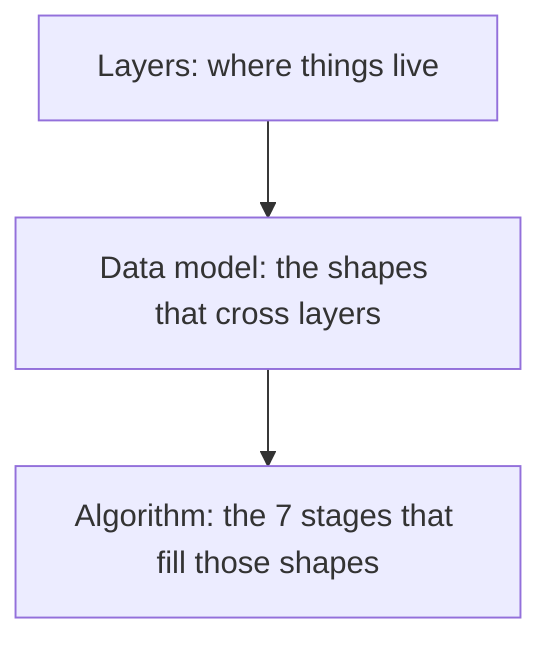

# 02 · Architecture

← [Guide](../README.md)

The "how it works inside": the binary's layers, the core Go types, and the 7-stage
pipeline that turns a `pg_catalog` into verdicts. Read this before touching code.

| Page | Covers |
|---|---|
| [Layers](layers.md) | The 10 `internal/` layers, one-way dependency, tech stack, the bar for a new dependency |
| [Data model](data-model.md) | The core structs — `Schema`, `Candidate`, `Signal`, `Verdict`, `Coverage` |
| [Algorithm](algorithm.md) | The 7 pipeline stages, each with the SQL or rule that implements it |

## See also

- [03 · Features & Safety](../03-features-and-safety/README.md) — the rules every change
  here has to respect
- [`openspec/specs/`](../../../openspec/specs/) — the formal spec per layer, in Portuguese
